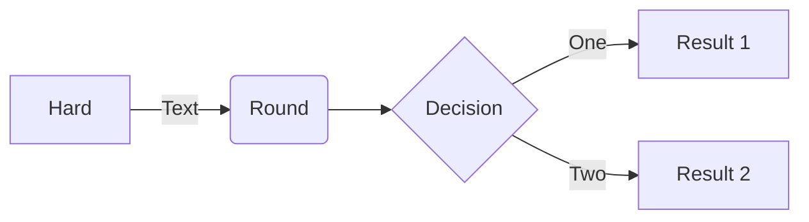

# Stak Scheme: The tiny R7RS-small implementation

Yota Toyama

At Scheme Workshop 2025

---

# Portable memory snapshot

```mermaid
flowchart LR

A[Hard] -->|Text| B(Round)
B --> C{Decision}
C -->|One| D[Result 1]
C -->|Two| E[Result 2]
```
